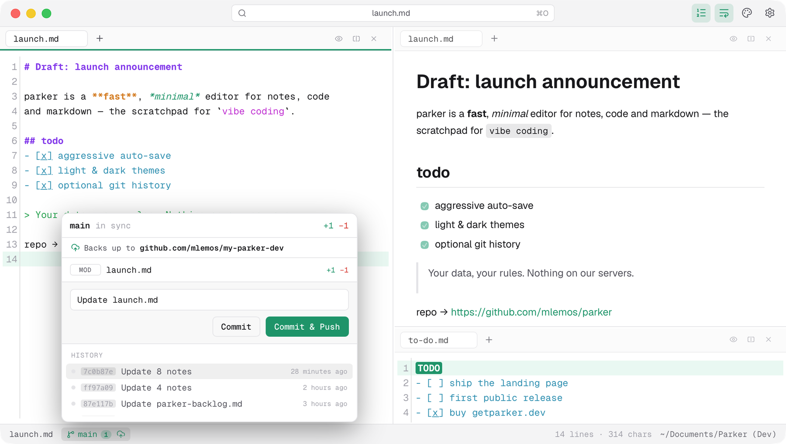
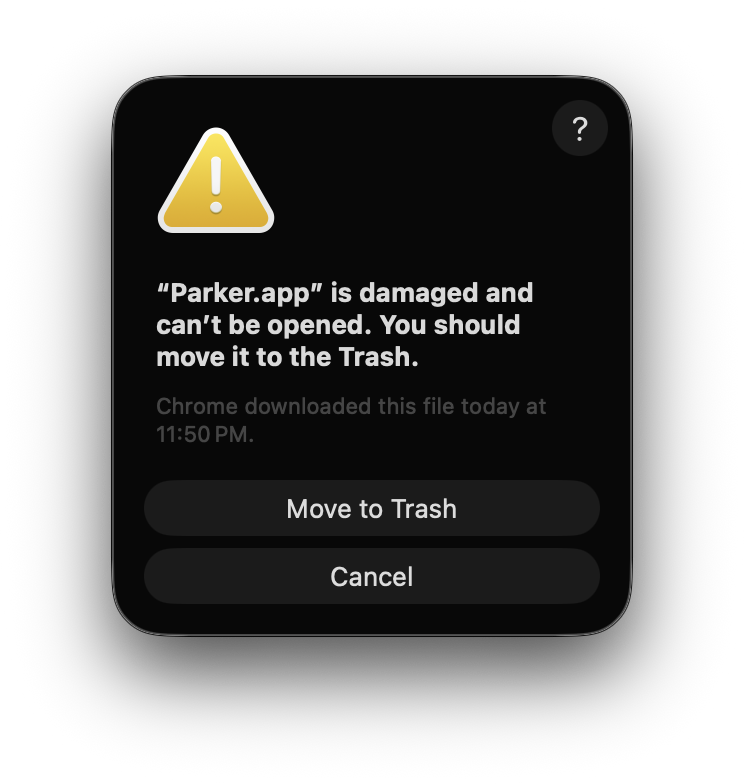

<p align="center">
  <picture>
    <source media="(prefers-color-scheme: dark)" srcset="site/brand/logo-horizontal-paper.png">
    
  </picture>
</p>

<p align="center"><strong>The scratchpad for vibe coding.</strong></p>

<p align="center">
  A fast, minimal Mac editor for notes, code &amp; markdown —<br>
  the serious scratchpad for working with AI, without the weight of Notes or VS&nbsp;Code.
</p>

<p align="center">
  
  <a href="LICENSE"></a>
  
  
  <a href="https://getparker.dev"></a>
</p>

<p align="center">
  <picture>
    <source media="(prefers-color-scheme: dark)" srcset="site/brand/parker-app.png">
    
  </picture>
</p>

---

> [!NOTE]
> **parker is beta, and personal.** It isn't a commercial product — it's a passion
> project, vibe-coded for my own use and shared with the world. **No guarantees, no
> support, use at your own risk.** 🙂

## What is parker?

parker is a **resident menu-bar app** for macOS — summon it from anywhere with a
global shortcut, jot or draft, dismiss it, and never lose a thought. It's built for
the way people work with AI today: long prompts, task lists, quick snippets and
throwaway notes that deserve something faster than Notes and lighter than VS Code.

It operates on a plain folder of files you own. No accounts, no database, no
servers of ours — ever.

## ✨ Features

- **Instant & fast** — opens in a blink, zero lag while typing. No splash, no spinners, no "syncing…".
- **Keyboard-first** — summon with a global shortcut; almost everything is reachable without the mouse.
- **Lightweight** — a tiny native shell on [Tauri](https://tauri.app/), around 10&nbsp;MB. All editor, no bloat.
- **Never lose data** — aggressive auto-save, always on, plus optional git backup as a safety net.
- **Split & preview** — split panes and live Markdown preview, side by side.
- **Genuinely themeable** — Vercel Night, Vercel Day, GitHub light & dark; monochrome chrome, vivid syntax.
- **Your data, your rules** — plain `.md`, `.txt` and code on disk, in a folder you choose.

## 🔒 Your data, your rules

parker **always writes straight to disk** — plain files in a folder you own. Never a
database, never a cloud you don't control. Sync it however you like (iCloud, Dropbox,
whatever); parker stays completely sync-agnostic.

Want it all in git? **It's built in.** Flip on git backup and every save is committed
and pushed — fully versioned, with a history you can roll back. A safety net *on top
of* your files, never where they live.

## ⬇️ Install

> **Beta, and not code-signed.** Parker is provided as-is, with no warranty — use at your own risk and keep backups (its Git sync helps).

1. Download the latest `.dmg` from **[Releases](https://github.com/mlemos/parker/releases)**.
   Requires **macOS on Apple Silicon** (M1/M2/M3…) — the build is `arm64` and does **not** run on Intel Macs.
2. Open the `.dmg` and drag **Parker** into **Applications**.

### "Parker.app is damaged and can't be opened" — this is expected

Parker isn't signed with an Apple Developer ID or notarized, so after a browser download macOS quarantines it and, on Apple Silicon, shows this:

<p align="center">
  
</p>

**The app is not actually damaged** — that's just Gatekeeper blocking an un-notarized download. Do **not** click _Move to Trash_. Instead, clear the quarantine flag once, in the Terminal:

```bash
xattr -cr /Applications/Parker.app
```

Then open Parker normally (double-click). You only need to do this once per install.

> To remove this step entirely, the app would need to be signed and notarized with an Apple Developer ID.

## 🛠️ Build from source

**Prerequisites:** [Rust](https://rustup.rs/), [Node](https://nodejs.org/) and [pnpm](https://pnpm.io/).

```bash
pnpm install       # install frontend deps
pnpm tauri dev     # run the app (compiles Rust the first time — be patient)
pnpm tauri build   # produce a distributable .app / .dmg
```

## 🧱 Tech stack

| Layer     | Choice |
|-----------|--------|
| Shell     | [Tauri 2](https://tauri.app/) — tiny native shell (Rust backend + system WebView) |
| UI        | React + TypeScript |
| Editor    | [CodeMirror 6](https://codemirror.dev/) — world-class editing, highlighting, themes |

Chosen for **leveza** (lightness) and a world-class editor component on a web stack,
wrapped in a native Mac shell.

## 🗂️ Repo layout

```
parker/
├─ src/          # frontend — React / TypeScript / CodeMirror
├─ src-tauri/    # backend — Rust (menu-bar app, file & session commands)
├─ public/       # static assets, app entry
└─ site/         # the landing page → getparker.dev (deploys to Vercel, root = site/)
```

## 🤝 Contributing

Issues and pull requests are welcome. For anything substantial, open an issue first
so we can talk it through. Keep changes small, focused, and in the spirit of the app:
fast, minimal, keyboard-first.

## 👤 Author

Built by **Manoel Lemos** —
[Website](https://manoellemos.com) ·
[X](https://x.com/mlemos) ·
[LinkedIn](https://linkedin.com/in/mlemos) ·
[GitHub](https://github.com/mlemos)

## 📄 License

[MIT](LICENSE) © 2026 [Manoel Lemos](https://manoellemos.com).

<p align="center">
  <sub>Made for people who think before they type. · <a href="https://getparker.dev">getparker.dev</a></sub>
</p>
